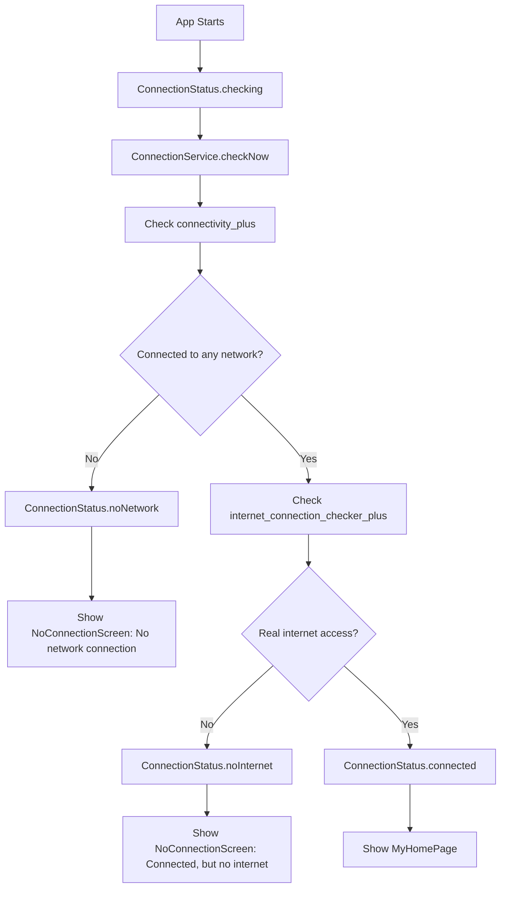
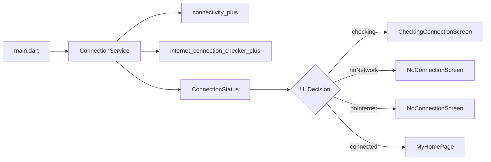
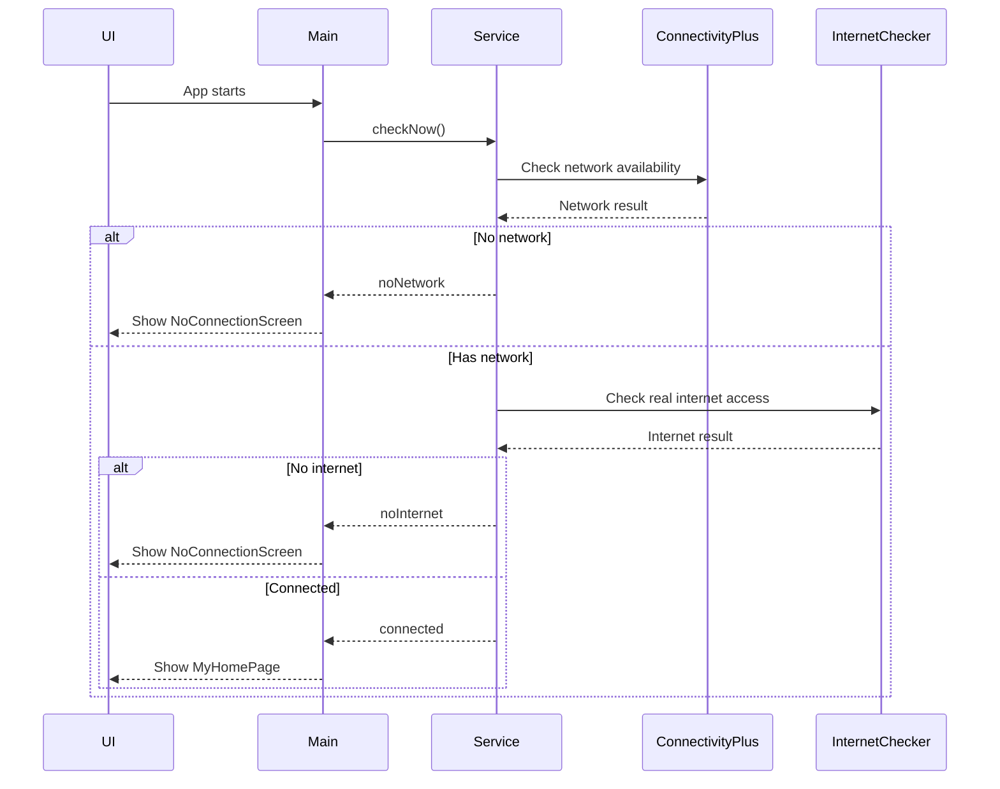

<div align="center">

# 🌐 Connection Test

### A Flutter educational project for better connection-state UX

<p>
  
  
  
</p>

<p>
  <b>This project explains why “No Internet” is not always enough.</b>
</p>

<p>
  📵 No Network &nbsp;&nbsp; | &nbsp;&nbsp; 🛜 Network Without Internet &nbsp;&nbsp; | &nbsp;&nbsp; ✅ Connected
</p>

</div>

---

## 📌 About

`connection_test` is a small Flutter educational project that demonstrates a better way to handle internet connection UX.

Many apps show one generic message:

> No internet connection

But this message is not always accurate.

A device can be in different connection states:

- Not connected to any network
- Connected to Wi-Fi or mobile data, but the network has no real internet
- Connected to a working network with real internet access

This project separates these cases clearly.

---

## 🎯 Project Goal

The goal is to teach how to detect and display accurate connection states in Flutter.

The app uses:

| Package | Purpose |
|---|---|
| `connectivity_plus` | Detects if the device is connected to any network |
| `internet_connection_checker_plus` | Checks if the connected network has real internet access |

---

## 🧠 Why Use Two Packages?

Because each package answers a different question.

### `connectivity_plus`

Answers:

> Is the device connected to any network?

Examples:

- Wi-Fi
- Mobile data
- Ethernet
- No network

But it does **not** guarantee real internet access.

---

### `internet_connection_checker_plus`

Answers:

> Does the current network actually have internet access?

Example:

The phone may be connected to Wi-Fi, but the router itself may not have internet.

This project treats that as a different UX state.

---

## 🔄 Connection States

The app uses this enum inside `connection_service.dart`:

```dart
enum ConnectionStatus {
  checking,
  noNetwork,
  noInternet,
  connected,
}
```

| State | Meaning | UI Result |
|---|---|---|
| `checking` | The app is checking the current connection | Shows loading screen |
| `noNetwork` | Device is not connected to Wi-Fi, mobile data, or any network | Shows no network screen |
| `noInternet` | Device is connected to a network, but the network has no internet | Shows no internet screen |
| `connected` | Device has a working internet connection | Shows the main Flutter home screen |

---

## 🧩 Connection Flow



---

## 🏗️ Current Project Structure

```text
lib/
│
├── main.dart
│   └── Starts the app, monitors connection state, and chooses the correct screen
│
├── app_strings.dart
│   └── Centralizes user-facing text used across the app
│
├── assets_data.dart
│   └── Holds image asset paths used by the UI
│
├── checking_connection_screen.dart
│   └── Shows a loading screen while the app checks the connection
│
├── connection_service.dart
│   └── Contains ConnectionStatus and the connection decision logic
│
└── no_connection_screen.dart
    └── Displays noNetwork and noInternet UI states
```

---

## 🧱 App Architecture



---

## 🖥️ UI Screens

### 🔄 Checking Connection

Displayed while the first connection check is running.

```text
Checking your connection...
```

This avoids showing a wrong offline screen before the app knows the real connection state.

---

### 📵 No Network Connection

Displayed when the device is not connected to Wi-Fi, mobile data, or any network.

```text
No network connection

Your device is not connected to Wi-Fi or mobile data.
```

---

### 🛜 Connected, But No Internet

Displayed when the device is connected to a network, but that network has no real internet access.

```text
Connected, but no internet

Your device is connected to a network,
but this network has no internet access.
```

---

### ✅ Connected

Displayed when the device has a working internet connection.

Current implementation shows the default Flutter counter home screen.

---

## ✅ Core Logic

The main decision happens in `ConnectionService.checkNow()`.

```dart
final results = await _connectivity.checkConnectivity();

final hasNetwork = results.any(
  (result) => result != ConnectivityResult.none,
);

if (!hasNetwork) {
  return ConnectionStatus.noNetwork;
}

final hasInternet = await _internetConnection.hasInternetAccess;

return hasInternet
    ? ConnectionStatus.connected
    : ConnectionStatus.noInternet;
```

---

## 👀 Watching Connection Changes

The app listens to both:

- Network changes from `connectivity_plus`
- Real internet status changes from `internet_connection_checker_plus`



---

## 🚫 Common Mistake

Do not use `connectivity_plus` alone to say the user has internet.

This is not enough:

```dart
if (connectivityResult != ConnectivityResult.none) {
  // User has internet
}
```

Why?

Because the device may be connected to Wi-Fi, but the Wi-Fi itself may not have internet access.

---

## ✅ Better UX Rule

Use this order:

```text
1. Check if the device is connected to any network
2. If yes, check if that network has real internet access
3. Show a specific message for the exact problem
```

---

## 📦 Dependencies

```yaml
dependencies:
  connectivity_plus:
  internet_connection_checker_plus:
```

---

## 📱 Android Permissions

The app requires these permissions:

```xml
<uses-permission android:name="android.permission.INTERNET" />
<uses-permission android:name="android.permission.ACCESS_NETWORK_STATE" />
```

---

## 🚀 Getting Started

### 1. Clone the repository

```bash
git clone https://github.com/MOMEN56/connection_test.git
```

### 2. Open the project

```bash
cd connection_test
```

### 3. Install dependencies

```bash
flutter pub get
```

### 4. Run the app

```bash
flutter run
```

---

## 🧪 Manual Test Scenarios

| Scenario | Expected Result |
|---|---|
| Turn off Wi-Fi and mobile data | Shows `No network connection` |
| Connect to Wi-Fi without internet | Shows `Connected, but no internet` |
| Connect to working Wi-Fi or mobile data | Shows the main home screen |
| Open the app while checking connection | Shows loading screen |

---

## 🧑‍💻 Educational Notes

This project is intentionally simple.

It does not use:

- Bloc
- Provider
- Riverpod
- Clean Architecture
- Complex state management

The goal is to keep the connection logic easy to understand for Flutter beginners.

---

## ✨ Learning Outcomes

After studying this project, you should understand:

- The difference between network availability and real internet access
- Why `connectivity_plus` alone is not enough
- How to use `internet_connection_checker_plus` after confirming network availability
- How to avoid misleading offline messages
- How to keep connection logic in one service
- How to keep UI screens focused only on displaying state

---

## 🧭 Final Idea

<div align="center">

### Better UX does not only say:

## ❌ No Internet

### It explains the real problem:

## 📵 No Network  
## 🛜 Connected Without Internet  
## ✅ Connected Successfully

</div>

---

## 📄 License

This project is created for educational purposes.

---

<div align="center">

Made with ❤️ using Flutter

</div>
