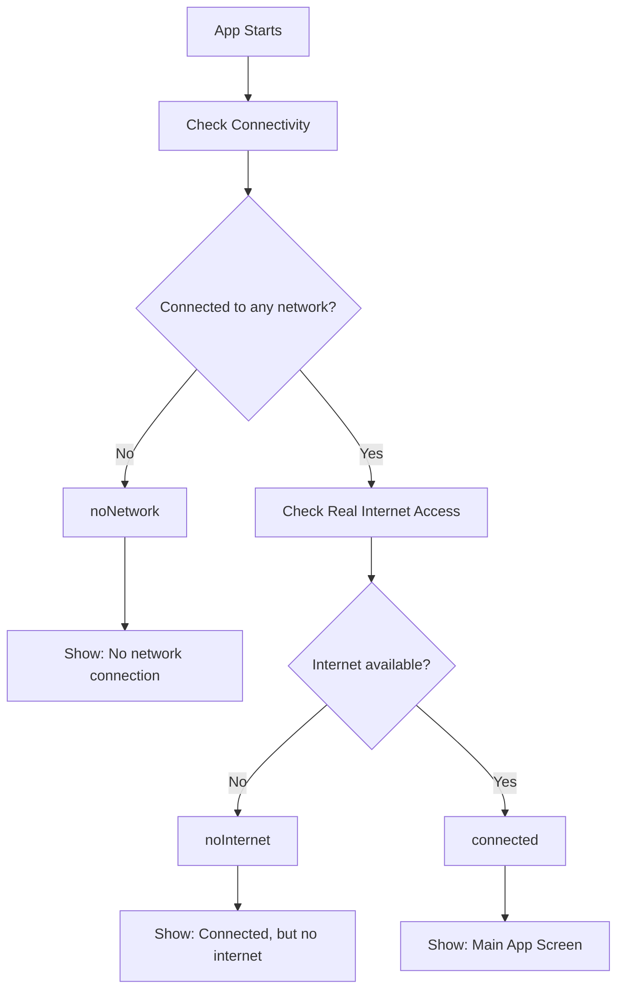
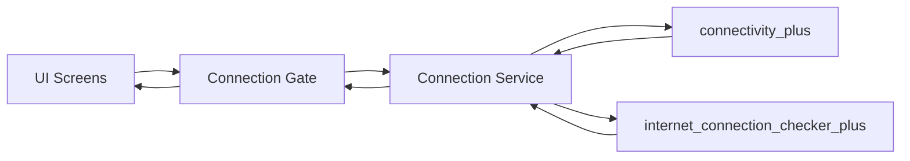
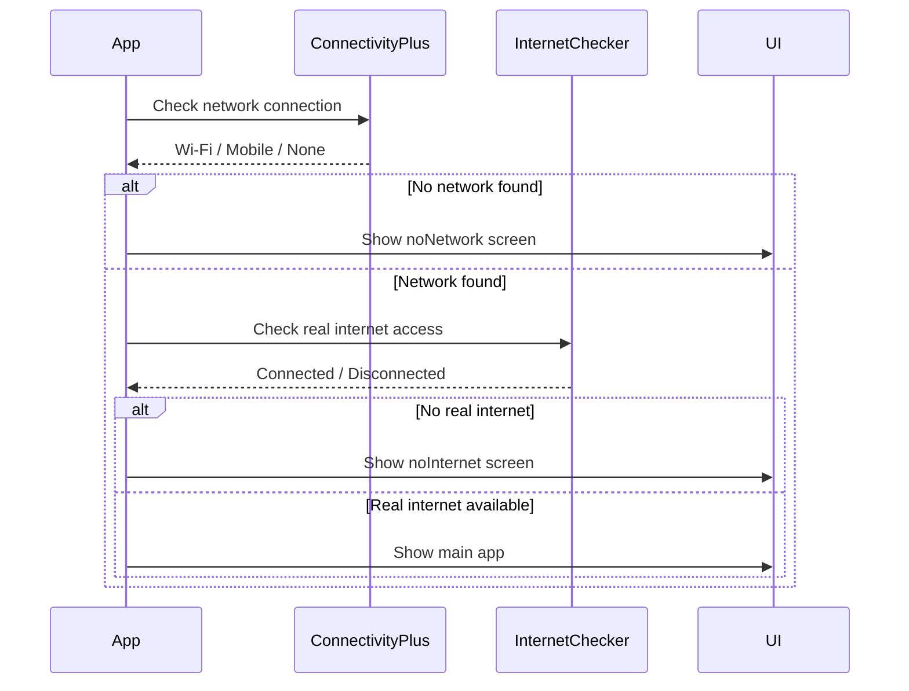

<div align="center">

# 🌐 Connection Test

### A Flutter educational project for building better internet connection UX

<p>
  
  
  
</p>

<p>
  <b>Not every connection problem is the same.</b><br/>
  This project teaches how to distinguish between:
</p>

<p>
  📵 No Network &nbsp;&nbsp; | &nbsp;&nbsp; 🛜 Fake Connection &nbsp;&nbsp; | &nbsp;&nbsp; ✅ Real Internet
</p>

</div>

---

## 📌 About the Project

`connection_test` is a small Flutter educational project focused on improving the user experience when the device has internet connection issues.

Most apps simply show:

> No internet connection

But that message is not always accurate.

Sometimes the device is not connected to any network at all.  
Sometimes the device is connected to Wi-Fi, but the Wi-Fi itself has no internet access.  
Sometimes everything works fine.

This project explains these states clearly using:

| Package | Purpose |
|---|---|
| `connectivity_plus` | Detects whether the device is connected to any network |
| `internet_connection_checker_plus` | Checks whether the connected network has real internet access |

---

## 🎯 Project Goal

The goal is to create a better UX by showing accurate connection messages.

Instead of using one generic offline message, the app separates connection states into clear cases:

```dart
enum ConnectionStatus {
  checking,
  noNetwork,
  noInternet,
  connected,
}
```

---

## 🧠 Why Two Packages?

Because they solve different problems.

### `connectivity_plus`

This package answers:

> Is the device connected to any network?

Examples:

- Wi-Fi
- Mobile data
- Ethernet
- No network

But it does **not** guarantee that the network has real internet access.

---

### `internet_connection_checker_plus`

This package answers:

> Does this network actually have internet access?

Example:

Your phone may be connected to Wi-Fi, but the router may have no internet.

That is called a fake connection or limited connection.

---

## 🔍 Connection States

| State | Meaning | UX Message |
|---|---|---|
| `checking` | The app is checking the current connection | Checking connection... |
| `noNetwork` | The device is not connected to Wi-Fi, mobile data, or any network | No network connection |
| `noInternet` | The device is connected to a network, but the network has no real internet access | Connected, but no internet |
| `connected` | The device is connected to a network and has real internet access | Connected successfully |

---

## 🧩 Connection Logic Diagram



---

## 🏗️ Recommended Architecture



---

## 🧱 App Layers

```text
lib/
│
├── main.dart
│   └── Starts the app and displays the correct screen based on connection state
│
├── connection_status.dart
│   └── Contains the ConnectionStatus enum
│
├── connection_service.dart
│   └── Contains the core connection decision-making logic
│
├── no_connection_screen.dart
│   └── Displays UI for noNetwork and noInternet states
│
├── assets_data.dart
│   └── Contains image asset paths
│
└── home_screen.dart
    └── Main screen when internet is available
```

---

## 🎨 UX Screens

### 📵 No Network Connection

Displayed when the device is not connected to any network.

```text
No Network Connection

Your device is not connected to Wi-Fi or mobile data.
Please connect to a network and try again.
```

---

### 🛜 Connected, But No Internet

Displayed when the device is connected to Wi-Fi or mobile data, but the network has no real internet access.

```text
Connected, But No Internet

Your device is connected to a network,
but this network has no internet access.
Please try another network.
```

---

### ✅ Connected

Displayed when the device has a real working internet connection.

```text
Connected Successfully

Your internet connection is working properly.
```

---

## ⚙️ How It Works

The logic should follow this order:



---

## ✅ Correct Decision Flow

```dart
final connectivityResults = await Connectivity().checkConnectivity();

final hasNetwork = connectivityResults.any(
  (result) => result != ConnectivityResult.none,
);

if (!hasNetwork) {
  return ConnectionStatus.noNetwork;
}

final hasInternet = await InternetConnection().hasInternetAccess;

if (!hasInternet) {
  return ConnectionStatus.noInternet;
}

return ConnectionStatus.connected;
```

---

## 🚫 Common Mistake

Do not use `connectivity_plus` alone to decide if the user has internet.

This is incorrect:

```dart
if (connectivityResult != ConnectivityResult.none) {
  // User has internet
}
```

Why?

Because the device may be connected to Wi-Fi, but the Wi-Fi may not have internet access.

---

## ✅ Better Approach

Use both packages together:

```text
connectivity_plus
↓
Checks if the device is connected to any network

internet_connection_checker_plus
↓
Checks if that network has real internet access
```

---

## 📦 Packages Used

```yaml
dependencies:
  connectivity_plus:
  internet_connection_checker_plus:
```

---

## 🚀 Getting Started

### 1. Clone the repository

```bash
git clone https://github.com/MOMEN56/connection_test.git
```

### 2. Open the project

```bash
cd connection_test
```

### 3. Install dependencies

```bash
flutter pub get
```

### 4. Run the app

```bash
flutter run
```

---

## 🧪 Test Scenarios

You can test the app manually using these cases:

| Scenario | Expected Result |
|---|---|
| Turn off Wi-Fi and mobile data | Show `No network connection` |
| Connect to Wi-Fi with no internet | Show `Connected, but no internet` |
| Connect to working Wi-Fi or mobile data | Show main app screen |
| Start app while connection is being checked | Show checking/loading state |

---

## 🧠 Learning Outcomes

After studying this project, you should understand:

- The difference between network connection and real internet access
- Why `connectivity_plus` alone is not enough
- How to create better offline UX
- How to avoid misleading connection messages
- How to centralize connection logic in one service
- How to keep UI screens simple and clean

---

## ✨ UI State Preview

| State | Icon | Description |
|---|---|---|
| Checking | 🔄 | The app is checking the current connection |
| No Network | 📵 | The device is not connected to any network |
| No Internet | 🛜⚠️ | The device is connected to a network without real internet |
| Connected | ✅ | The device has a working internet connection |

---

## 📱 Android Permissions

The app needs these permissions in `AndroidManifest.xml`:

```xml
<uses-permission android:name="android.permission.INTERNET"/>
<uses-permission android:name="android.permission.ACCESS_NETWORK_STATE"/>
```

---

## 🧭 Final UX Rule

<div align="center">

### Good connection UX does not only say:
## ❌ "No Internet"

### It explains the real problem:
## 📵 No Network
## 🛜 Connected Without Internet
## ✅ Connected Successfully

</div>

---

## 📄 License

This project is created for educational purposes.

---

<div align="center">
